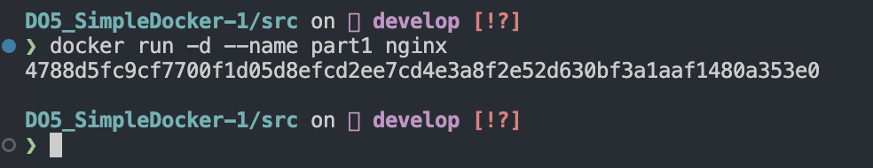
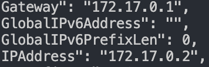
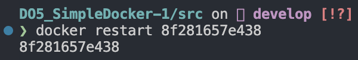
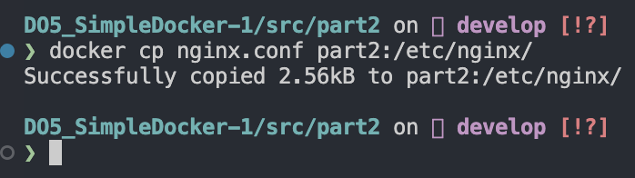

# Simple Docker

Введение в докер. Разработка простого докер-образа для собственного сервера.

## Содержание 

1. [Part 1. Готовый докер](#part-1-готовый-докер)
2. [Part 2. Операции с контейнером](#part-2-операции-с-контейнером)
3. [Part 3. Мини веб-сервер](#part-3-мини-веб-сервер)
4. [Part 4. Свой докер](#part-4-свой-докер)
5. [Part 5. Dockle](#part-5-dockle)
6. [Part 6. Базовый Docker Compose](#part-6-базовый-docker-compose)

## Part 1. Готовый докер

- Возьмем официальный докер-образ с **nginx** и выкачаем его при помощи `docker pull`. 

- Проверим наличие докер-образа через `docker images`.

- Запустим докер-образ через `docker run -d [image_id|repository]`.

- Проверим, что образ запустился через `docker ps`

- Посмотрим информацию о контейнере через `docker inspect [container_id|container_name]`.

- По выводу команды определим и поместим в отчёт:
  - Размер контейнера
  
  - Список замапленных портов
  
  - Ip контейнера
  

- Остановим докер образ через `docker stop [container_id|container_name]`.

- Проверим, что образ остановился через `docker ps`.

- Запустим докер с портами 80 и 443 в контейнере, замапленными на такие же порты на локальной машине, через команду *run*.

- Проверим, что в браузере по адресу *localhost:80* доступна стартовая страница **nginx**.

- Перезапустим докер контейнер через `docker restart [container_id|container_name]`.

- Проверим через `docker ps` , что контейнер перезапустился.

## Part 2. Операции с контейнером

- Прочитаем конфигурационный файл *nginx.conf* внутри докер контейнера через команду *exec*.

- Создаем на локальной машине файл *nginx.conf* используя команду `touch nginx.conf`

- Настраиваем в нем по пути */status* отдачу страницы статуса сервера **nginx**.

- Скопируем созданный файл *nginx.conf* внутрь докер-образа через команду `docker cp`.

- Перезапустим **nginx** внутри докер-образа через команду *exec*.

- Проверим, что по адресу `localhost:80/status` отдается страничка со статусом сервера **nginx**.

- Экспортируем контейнер в файл *container.tar* через команду *export*.

- Остановим контейнер.

- Удалим образ через `docker rmi [image_id|repository]`, не удаляя перед этим контейнеры.

- Удалим остановленный контейнер.

- Импортируем контейнер обратно через команду *import*.

- Запустим импортированный контейнер.

- Проверь, что по адресу *localhost:80/status* отдается страничка со статусом сервера **nginx**.

## Part 3. Мини веб-сервер

- Напишем мини-сервер на **C** и **FastCgi**, который будет возвращать простейшую страничку с надписью `Hello World!`.

- Запустим написанный мини-сервер через *spawn-fcgi* на порту 8080. Для этого:
    - Создадим контейнер с замапленным портом `81`.

    

    - Откроем интерактивный терминал внутри контейнера команджой `docker exec -it part3 /bin/bash`

    

    - Установим необходимые бибилотеки используя команды:
        - `apt-get update`  
        - `apt-get install gcc` 
        - `apt-get install spawn-fcgi` 
        - `apt-get install libfcgi-dev`
    
    - Скопируем наш минисервер в контейнер.

    

    - Скомпилируем мини-сервер.

    

    - Запустим наш мини-сервер.

    

- Напишем свой *nginx.conf*, который будет проксировать все запросы с 81 порта на *127.0.0.1:8080*.

- Скопируем *nginx.conf* в контейнер.

- Проверим, что в браузере по *localhost:81* отдается написанная тобой страничка.

- На локальной машине положим созданный файл `nginx.conf` по пути `./nginx/nginx.conf`.

## Part 4. Свой докер

- Напишем свой докер-образ, который:
    - собирает исходники мини сервера на FastCgi из [Части 3](#part-3-мини-веб-сервер);
    - запускает его на 8080 порту;
    - копирует внутрь образа написанный *./nginx/nginx.conf*;
    - запускает **nginx**.

- Соберем написанный докер-образ через `docker build` при этом указав имя и тег.

- Проверим что образ появился 

- Запустим собранный докер-образ с маппингом 81 порта на 80 на локальной машине и маппингом папки *./nginx* внутрь контейнера по адресу, где лежат конфигурационные файлы **nginx**'а

- Проверим, что по localhost:80 доступна страничка написанного мини сервера.

- Допишем в *./nginx/nginx.conf* проксирование странички */status*, по которой надо отдавать статус сервера **nginx**.

- Перезапустим докер-образ.

- Проверим, что теперь по *localhost:80/status* отдается страничка со статусом **nginx**

## Part 5. Dockle

- Просканируем образ из предыдущего задания через `dockle [image_id|repository]`.

- Исправим образ так, чтобы при проверке через **dockle** не было ошибок и предупреждений.

- Сканируем образ снова.

## Part 6. Базовый Docker Compose

- Напишем файл *docker-compose.yml*, с помощью которого:
    - Подними докер-контейнер из [Части 5](#part-5-инструмент-dockle) _(он должен работать в локальной сети, т.е. не нужно использовать инструкцию **EXPOSE** и мапить порты на локальную машину)_.
    - Подними докер-контейнер с **nginx**, который будет проксировать все запросы с 8080 порта на 81 порт первого контейнера.
    Замапь 8080 порт второго контейнера на 80 порт локальной машины.

- Соберем и запустим проект с помощью команд `docker-compose build` и `docker-compose up`.

- Проверим, что в браузере по *localhost:80* отдается написанная страничка, как и ранее.

[**К содержанию**](#Содержание) 

